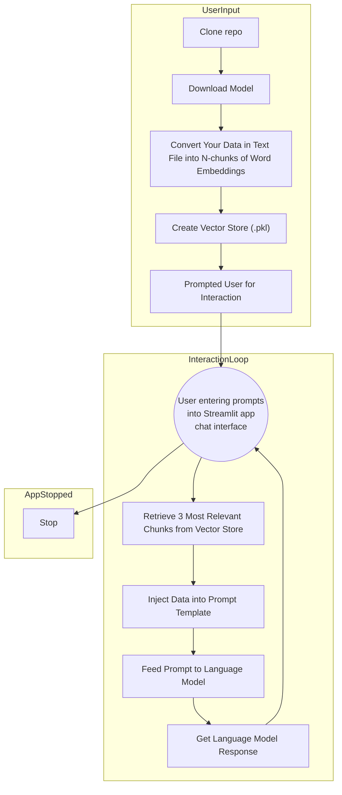

# my-own-llm
My Own Local LLM is a Large Language Model (LLM) app to run locally with models optimized for CPU with the intention of experimenting in "tailoring" the LLM to your own data with word embeddings and a prompt engineering template. A text file of your own data is converted into word embeddings with the LangChain FAISS library and a prompt template is then used to optimize the interaction (typical) between the user and the LLM. 

The project incorporates the [llama-cpp-python](https://github.com/abetlen/llama-cpp-python) with compressed CPU-optimized GGML models. Currently I am testing on Windows 10 with 16 Gigs of RAM and a question to the LLM can take anywhere from 2-10 minutes to get a response, but the content has been good.

Please note that this project is still in its conceptual stage and is actively being developed. Contributions and feedback are welcome as we strive to make this idea a reality. Feel free to comment on any of the processes mentioned here as the learning curve has been steep and the industry is evolving at fast pace.



## The Large Language Model (LLM)
The `model` subdirectory contains a script named `download_model.py`. When executed, this script will download a model from HuggingFace. Be aware that the model file sizes are relatively large, weighing approximately 3-10 gigabytes. See script and comment out which model you want to experiment with. More testing needs to be done to find one that works best.

**llama-2-7b-chat.ggmlv3.q2_K.bin**
* Bits: 2
* Size: 2.87 GB
* Max RAM required: 5.37 GB
* Use case: This variant uses GGML_TYPE_Q4_K for the attention.vw and feed_forward.w2 tensors, and GGML_TYPE_Q2_K for the other tensors.

**llama-2-7b-chat.ggmlv3.q6_K.bin**
* Bits: 6
* Size: 5.53 GB
* Max RAM required: 8.03 GB
* Use case: This variant uses GGML_TYPE_Q8_K for all tensors, employing 6-bit quantization.

To obtain the model, run the following command:
``` bash
$ python download_model.py
```

## My Data
The project contains a `my_data` subdirectory that houses a text file which is to be customized and cleaned to your application specific use case. The text file is converted into [word embeddings](https://learn.microsoft.com/en-us/semantic-kernel/memories/embeddings), embeddings are then saved as a .pickle file, and ultimetely acts similar to a [vector database](https://learn.microsoft.com/en-us/semantic-kernel/memories/vector-db) which is used by the Streamlit app for data retrieval. The data retrieval is then in a sense injected into the prompt template to give the LLM more of a better sense on what the user could be asking for in an application specific use case. 

The `my_data` directory also contains two Python scripts (pdf_to_text_converter.py and word_to_text_converter.py) to convert PDF or Word documents into text files and process them for use with the LLM. From my expereince I find it nice to clean the data from PDF or Word and provide the final product in a text file. For my application specific industry I work the example all HVAC industry related information in the text file. Name of the text file does not matter, only 1 text file can exist in this directory which is then conerted into a pickle file.

To execute the script that converts the text into embeddings and a then saves pickle file to the `my_data` directory follow these steps:

``` bash
$ python make_embeddings.py
```
Under the hood of what `make_embeddings.py` handles is outlined below. 

**Data Preprocessing**:
Before utilizing the data with the Language Model, it undergoes a preprocessing step. The script reads the content of the application-specific data in a text file and processes it to ensure that it is in a suitable format for further analysis. Preprocessing might involve removing any unwanted characters, special symbols, or irrelevant information from the text, thereby improving the quality and relevance of the Language Model's outputs.

**Chunking**:
To manage and process large text files efficiently, the script employs a chunking technique. The data is divided into smaller chunks, each containing a defined number of characters. Chunking serves multiple purposes. It helps in efficiently processing large files, reduces memory requirements, and allows for parallel processing when embedding and analyzing the data. Additionally, chunking allows the Language Model to focus on context more effectively, as it can process one chunk at a time, making predictions based on local information.

**Embeddings**:
The core of embeddings lies in representing text data as dense numerical vectors. These embeddings capture the semantic meaning and contextual information of the text in a continuous vector space. In this script, the Language Model uses the specified LLM model in the `model` directory (.bin), to create these embeddings for each chunk of text. These embeddings enable efficient similarity matching and information retrieval in subsequent steps.

**Vector Store Creation**:
The generated embeddings for each text chunk are then used to create a vector store using the Fast Approximate Nearest Neighbors Index (FAISS) library. The vector store is a data structure that allows for fast and efficient similarity searches in high-dimensional spaces. By utilizing FAISS, the script optimizes the stoembeddingse and retrieval of embeddings, making it computationally efficient even for large datasets.

**Pickle File Creation**:
To avoid recomputing the embeddings and the vector store each time the script is run, the generated vector store is serialized and saved as a pickle file (.pkl). This allows for easy and fast loading of the vector store in future executions of the script, saving valuable time and computational resources.

**Data Retrieval**:
The generated vector store, stored in the pickle file, acts as a repository of embeddings for the entire dataset. It serves as the foundation for data retrieval. When the Language Model is prompted with a specific query or context, it can now efficiently search for the most relevant information within the dataset by comparing the similarity of the query's embedding with the embeddings in the vector store. This data retrieval process enables the Language Model to provide more accurate and contextually appropriate responses to user queries. By default the **3 most revelavent "chunks" are retrieved from the data store** in a 1000 character format and inserted into the prompt template.


## Streamlit App
To interact with the Language Model (LLM) with your data and evaluate its capabilities, an input function within the script will prompt you to type commands directly into the console.

For running the LLM Streamlit app:
``` bash
$ python streamlit run app.py
```

To run the streamlit app with the prompt engineering template showing up in the browser use this addition arg:
``` bash
$ python streamlit run app.py -- --show_prompt_template
```

Below is an example of what the Streamlit app look like with the `--show_prompt_template` argument. As shown in the screenshot the response are a bit on the slow side for CPU as defined in the model inference time. Another thing to note is this screenshot below was before using the official prompt template as defined by the [TheBloke](https://huggingface.co/TheBloke/Llama-2-7B-Chat-GGML#prompt-template-llama-2-chat) for these compressed models available on HuggingFace. Please be aware when using this flag that the results may not look as pretty, for what ever reason the prompt template characters appear to interfer with Streamlit's front end rendering, just FYI.


## Next Steps and TODOs

The project is still under development, and there are several tasks to be completed:

1. **Additional Testing**: More extensive testing is needed to ensure the robustness and reliability of the LLM and its various components.

2. **Try on GPU**: Experiment with the Petals project on a Google Collab notebook.

3. **Try other non CPU-optimized models**: When hardware is available try on GPU

4. **Add memory**: Use Langchain memory features.

As development progresses, feedback, contributions, and suggestions from the community will be valuable in refining the project and achieving its goals.

## Inspiration

A many thanks to the [Prompt Engineer YouTube channel](https://www.youtube.com/@engineerprompt) for paving the way and creating great educational content for others like myself to learn from.

## Author

[linkedin](https://www.linkedin.com/in/ben-bartling-510a0961/)

## Licence

【MIT License】

Copyright 2023 Ben Bartling

Permission is hereby granted, free of charge, to any person obtaining a copy of this software and associated documentation files (the "Software"), to deal in the Software without restriction, including without limitation the rights to use, copy, modify, merge, publish, distribute, sublicense, and/or sell copies of the Software, and to permit persons to whom the Software is furnished to do so, subject to the following conditions:

The above copyright notice and this permission notice shall be included in all copies or substantial portions of the Software.

THE SOFTWARE IS PROVIDED "AS IS", WITHOUT WARRANTY OF ANY KIND, EXPRESS OR IMPLIED, INCLUDING BUT NOT LIMITED TO THE WARRANTIES OF MERCHANTABILITY, FITNESS FOR A PARTICULAR PURPOSE AND NONINFRINGEMENT. IN NO EVENT SHALL THE AUTHORS OR COPYRIGHT HOLDERS BE LIABLE FOR ANY CLAIM, DAMAGES OR OTHER LIABILITY, WHETHER IN AN ACTION OF CONTRACT, TORT OR OTHERWISE, ARISING FROM, OUT OF OR IN CONNECTION WITH THE SOFTWARE OR THE USE OR OTHER DEALINGS IN THE SOFTWARE.
